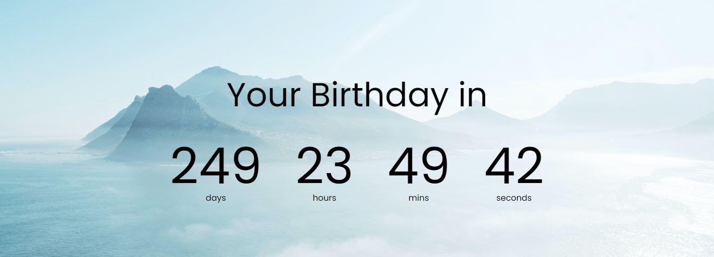

# Counter-timer

Counter-timer UI renders **the number of days, number of hours, number of minutes and number of seconds** left for your next birthday

Note:

1. Background image downloaded from **unsplash.com**

2. fonts style chosen from **fonts.google.com**(poppins)

index.html contains default template with fixed time values(days -> 0 hours -> 0 mins -> 0 seconds -> 0)

style.css file imports fonts from external url(https://fonts.googleapis.com/css2?family=Poppins&display=swap) and 

background image download from unsplash(https://unsplash.com/s/photos/snow)

script.js has a count function that calculates days, hours, mins and seconds left for your next birthday

difference between currentdate to birthdate is calculated(in seconds) and stored in a variable ->  totalseconds

Now, As declared below, using totalseconds value we can calculate number of days, hours, mins and seconds left for your next birthday

    const days = Math.floor(totalseconds / 3600 / 24)
    const hours = Math.floor(totalseconds / 3600) % 24
    const mins = Math.floor(totalseconds / 60) % 60
    const seconds = Math.floor(totalseconds) % 60
    
    
Result is:

-- Thanks for reading
